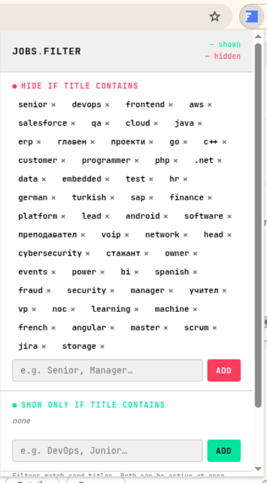

# Jobs.bg Filter

Това разширение за браузър ви позволява да филтрирате обяви за работа на jobs.bg по ключови думи в заглавията.

## Функции

- Добавяне и управление на ключови думи за филтриране
- Включване и изключване на филтрирането
- Постоянно съхранение на ключови думи
- Опция за приоритизиране на положителните филтри

## Как работи

Когато се приложи на главната страница на jobs.bg, разширението започва да филтрира обявите по думи - скрива тези, които съдържат отрицателни думи, и показва само тези, които съдържат положителни думи. По подразбиране първо се прилагат отрицателните филтри (скриват се съвпадащите), след това положителните (показват се само съвпадащите). Можете да превключите "Prioritize Positive" за да се прилагат първо положителните филтри (скриват се всички несъвпадащи), след това отрицателните (скриват се съвпадащите от останалите).

## Инсталация

1. Изтеглете или клонирайте това хранилище.
2. Отворете Chrome и отидете на `chrome://extensions/`.
3. Включете "Developer mode" в горния десен ъгъл.
4. Щракнете върху "Load unpacked" и изберете директорията на разширението.

## Използване

1. Навигирайте до [jobs.bg](https://www.jobs.bg/).
2. Щракнете върху иконата на разширението в лентата с инструменти, за да отворите изскачащия прозорец.
3. Добавете отрицателни думи (за скриване) и положителни думи (за показване).
4. Изберете дали да приоритизирате положителните филтри с чекбокса "Prioritize Positive".
5. Разширението автоматично прилага филтрите.

## Лиценз

Този проект е с отворен код. Вижте LICENSE за подробности.

---

# Jobs.bg Filter

This browser extension allows you to filter job listings on jobs.bg by keywords in the job titles.

## Features

- Add and manage keywords for filtering
- Toggle filtering on and off
- Persistent storage of keywords
- Option to prioritize positive filters

## How it works

When applied on the main page of jobs.bg, the extension starts filtering job listings by words - hiding those that contain negative words, and showing only those that contain positive words. By default, negative filters are applied first (hiding matches), then positive filters (showing only matches). You can toggle "Prioritize Positive" to apply positive filters first (hiding all non-matches), then negative filters (hiding matches from the remaining).

## Installation

1. Download or clone this repository.
2. Open Chrome and go to `chrome://extensions/`.
3. Enable "Developer mode" in the top right.
4. Click "Load unpacked" and select the extension directory.

## Usage

1. Navigate to [jobs.bg](https://www.jobs.bg/).
2. Click the extension icon in the toolbar to open the popup.
3. Add negative words (to hide) and positive words (to show).
4. Choose whether to prioritize positive filters with the "Prioritize Positive" checkbox.
5. The extension automatically applies the filters.

## License

This project is open source. See LICENSE for details.
